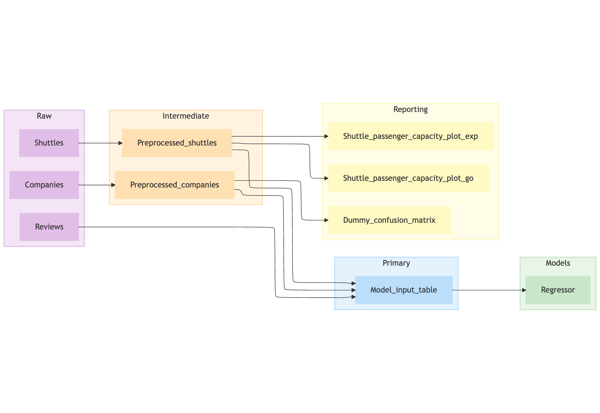

# kedro-mermaid

`kedro-mermaid` is a [Kedro](https://kedro.org) plugin that turns any pipeline into a ready-to-share [Mermaid](https://mermaid.js.org/) diagram. It plugs straight into the `kedro` CLI, prints the Mermaid markup, and supplies a direct link to the Mermaid live editor so you can fine-tune or embed the diagram wherever you need it.



## Features
- Generate Mermaid markup for any Kedro pipeline with a single command.
- Get an instant `mermaidchart.com` link to polish and share the diagram with stakeholders.
- Filter the graph by datasets, nodes, namespaces, or tags to focus on the parts that matter.
- Categorise nodes via regex patterns to produce colour-coded subgraphs automatically.
- Adjust Mermaid declarations and config values without manual post-processing.

## Prerequisites
- An existing Kedro project.
- Python 3.9+ and Kedro 0.19.8 or newer. The plugin is also compatible with Kedro 1.x projects.

## Installation
```bash
pip install kedro-mermaid
```
Installing the plugin adds a new `kedro mermaid` command group that's available whenever you activate your project environment.

## Quick Start
```bash
# inside your Kedro project directory
kedro mermaid generate
```
The command prints, in order:
- a Mermaid definition (for example, a `flowchart LR` block) that you can paste into Markdown, Sphinx, Notion, or any Mermaid-aware tool;
- a shareable `mermaidchart.com` link that opens the same diagram in the online editor.

To target a non-default pipeline, pass `--pipeline`:
```bash
kedro mermaid generate --pipeline=data_science
```

Need a reminder of the available flags? Run:
```bash
kedro mermaid --help
```

## Tailor the Diagram
Fine-tune the graph before you style it.

### Filter the graph
Combine the built-in filters to narrow the diagram to exactly what you need. Each option accepts a comma-separated list (for example, `--tags=model,reporting`).

| Option | Description |
| --- | --- |
| `--from-inputs` / `--to-outputs` | Start or end at specific datasets. |
| `--from-nodes` / `--to-nodes` | Trim the graph around selected node names. |
| `--nodes` | Include only the nodes you list. |
| `--tags` | Include only nodes that carry certain Kedro tags. |
| `--namespaces` | Include only nodes in chosen namespaces. |

You can also filter by regex: pass `--set-node-attr pattern=<regex>` to keep only nodes that match the pattern. Non-matching nodes disappear and their edges collapse (for example, `A -> B -> C` becomes `A -> C` when only `A` and `C` match).

### Categorise nodes
Node attributes support a `pattern` (any Python regex) so you can split node names into categories and labels using named capture groups. Use the `category` capture for the subgraph label and one or more `node` captures for the node label.
```bash
kedro mermaid generate \
  --set-node-attr pattern="(?P<category>\w+)__(?P<node>\w+)__?(?P<node>\w+)?"
```
When the pattern matches, the diagram groups nodes into Mermaid subgraphs and applies a colour palette automatically. The same matching behaviour described above applies: only nodes that satisfy the pattern remain in the simplified diagram.

### Style the output
Tweak Mermaid attributes without editing the generated code manually.

- Set the diagram declaration (default: `flowchart LR`):
    ```bash
    # Switch to a top-to-bottom layout
    kedro mermaid generate --set-graph-attr declaration="flowchart TB"
    # Switch back to left-to-right notation
    kedro mermaid generate --set-graph-attr declaration="graph LR"
    ```
- Supply Mermaid config options (default: empty):
    ```bash
    # Use the ELK layout engine
    kedro mermaid generate --set-graph-attr config.layout=elk
    ```

## Next steps
- Drop the generated markup into your documentation pipeline, or embed the live link in dashboards to keep stakeholders in sync.
- Pair the diagrams with Kedro datasets or nodes to create onboarding guides for new team members.
