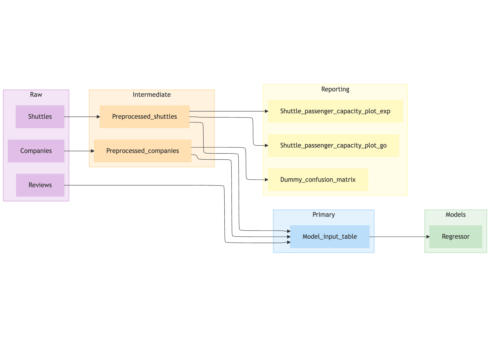

# Kedro Mermaid Plugin

Welcome to the documentation for `kedro-mermaid`, a Kedro plugin that turns any registered pipeline into a [Mermaid](https://mermaid.js.org/) diagram. The plugin plugs straight into the Kedro CLI, producing Mermaid markup and a shareable `mermaidchart.com` link that you can hand off to stakeholders or drop into docs and dashboards.

## What You Get
- **Instant diagrams** – run a single command and capture the structure of any pipeline.
- **Shareable links** – every run prints a ready-to-open Mermaid Live Editor URL.
- **Built-in filters** – scope the diagram to selected datasets, nodes, namespaces, or tags.
- **Regex-powered categories** – colour-code nodes and subgraphs automatically.
- **Configurable output** – tweak Mermaid declarations, edge styles, and layout config without post-processing.

!!! note
    This plugin generates static Mermaid diagrams. If you need an interactive Kedro-Viz-like experience, check out [kedro-viz](https://github.com/kedro-org/kedro-viz).

## Start Here
1. Read the [Getting Started guide](getting-started.md) to install the plugin and verify the integration with your Kedro project.
2. Follow the [pipeline filtering walkthrough](how-to/filter-the-diagram.md) to trim the graph to what matters.
3. Explore advanced styling in [Customise the Mermaid output](how-to/customise-the-diagram.md).
4. Check the [CLI reference](reference/cli.md) when you need details on flags or environment compatibility.

## Compatibility
- **Kedro**: 0.19.8+ (also works with 1.x projects).
- **Python**: 3.9 or newer.
- The plugin respects Kedro's pipeline API changes between 0.x and 1.x automatically.

## Reporting Issues & Contributing
If you spot a bug or want to suggest improvements, open an issue or pull request in the repository. Sharing the Kedro version, Python version, and command you executed helps us reproduce and fix problems quickly.

